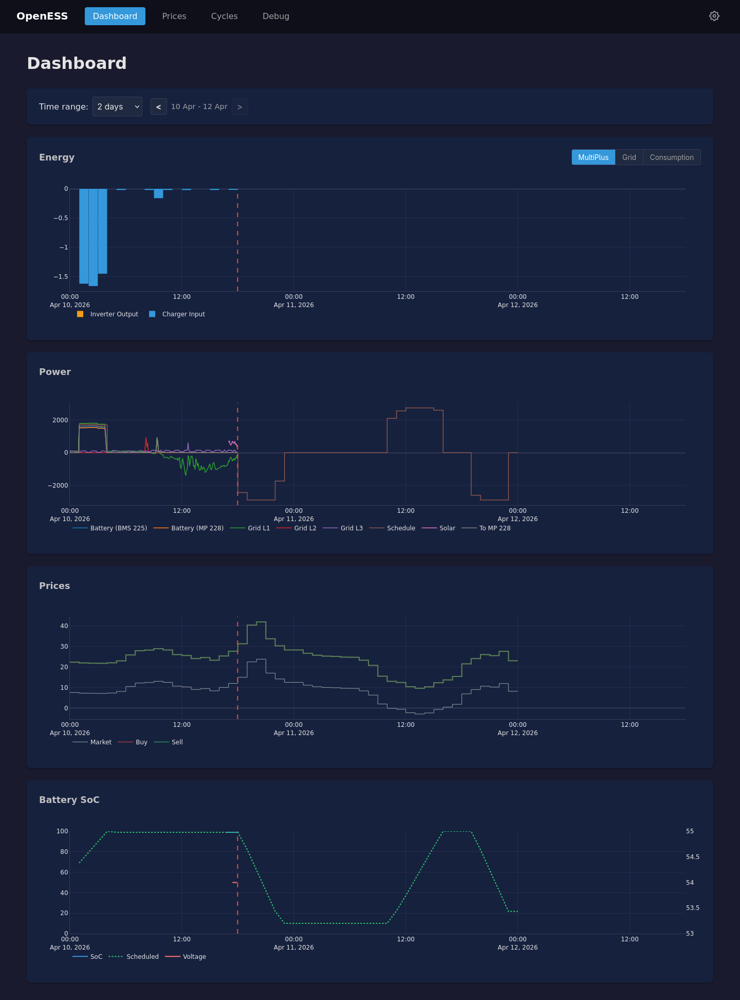

# OpenESS - Energy Storage System

An open-source battery charge/discharge scheduler that optimizes based on day-ahead electricity market prices. Maximize savings by charging when prices are low and discharging when high. Currently only Victron systems are supported but support for other systems will be implemented soon.

> **WARNING: Use at your own risk.** This software controls battery charging and discharging. Incorrect configuration or bugs could damage your equipment, void warranties, or cause safety hazards. The author accept no liability for any damages. Make sure you understand what you're doing before using this software.

**Early Development:** OpenESS is a work in progress. The config file structure is still expected to change.

## Why OpenESS?

Compared to the built-in [Dynamic ESS](https://vrm.victronenergy.com/) from Victron:

1. **Efficiency-aware optimization** - Conversion losses are modeled in the optimizer. Sometimes it's better to spread charging over more hours at lower power, which reduces losses and increases overall efficiency.

2. **Passthrough mode when idle** - Can disable the charger/inverter when the battery is idle, entering passthrough mode. For a MultiPlus-II this saves 50-75W, or more than 1 kWh per day.

## Requirements

- **ENTSO-E API key** - Register at [ENTSO-E Transparency Platform](https://transparency.entsoe.eu/) (see [entsoe-apy](https://github.com/BerriJ/entsoe-apy) for instructions)
- **Victron inverter/charger** - MultiPlus, MultiPlus-II, Quattro, or EasySolar
- **Victron GX device** - Cerbo GX, Venus GX, or similar
- **CBC solver** - Install via your package manager (e.g., `apt install coinor-cbc`)

Communication happens via Modbus TCP to the GX device. Direct VE.Bus communication is not supported (And Victron highly discourages this anyway).

## Installation

```bash
# Clone the repository
git clone https://github.com/DavidvtWout/OpenESS.git
cd OpenESS

# Create virtual environment
python -m venv venv
source venv/bin/activate

# Install OpenEss and its dependencies into the venv environment
pip install -e .
```

## Configuration

Copy the example configuration and edit it:

```bash
cp config.example.yaml config.yaml
```

See [docs/getting-started.md](docs/getting-started.md) for a reference of the steps to take to create a complete config file.

## Usage

```bash
open-ess --config config.yaml
```

## Planned Features

- **MQTT integration** - Subscribe to external metrics and publish control commands to non-Victron battery systems.

## Screenshot



## License

MIT License - see [LICENSE](LICENSE) for details.
